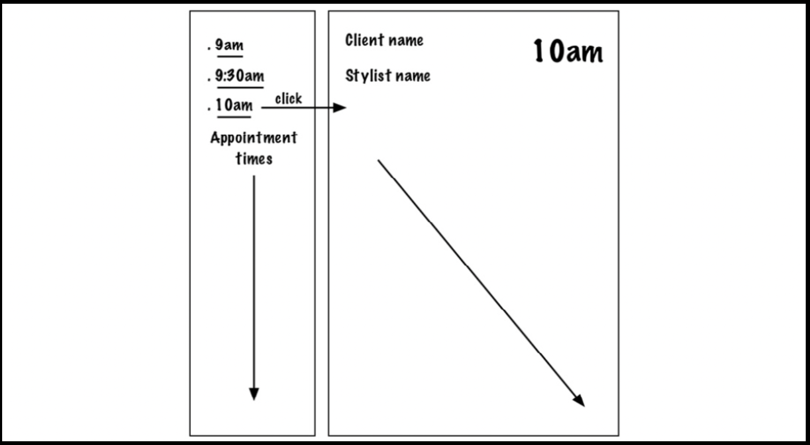

How to preview readme in vscode
type code README.md and then cmd+shift+v

# appointments-tdd

## Hair Salon Appointment React Application

## Views

• Appointment view

• AppointmentsDayView: a list of appointment times for the day.

## Testing

• Appointment Test

## Mock-up

• Appointment Component: This component takes an appointment and displays it using AppointmentsDayView component.

